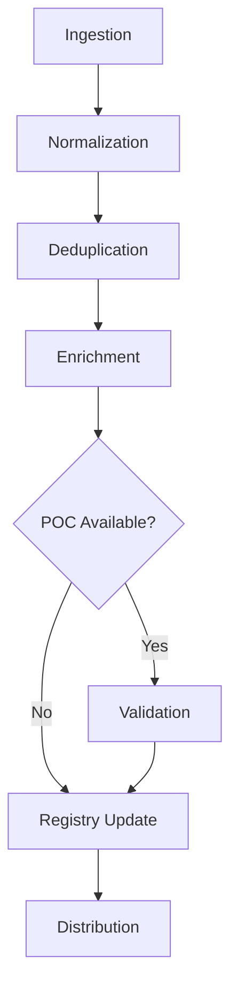

# Automated Attack Vector Registry — Architecture Brief

**Classification:** TLP:AMBER  
**Version:** 1.0  
**Created:** 2026-05-21  
**Owner:** GovSec Intelligence Cell  
**Distribution:** CSM, NACSA, MAMPU (TLP:AMBER recipients only)

---

## Executive Summary

The Automated Attack Vector Registry is a sovereign intelligence capability for continuous CVE monitoring, POC collection, and validated exploit analysis. This system eliminates dependency on commercial threat intelligence feeds while providing real-time attack vector intelligence to Malaysian GovSec ecosystem.

**Key Capabilities:**
- ✅ **9 Automated Sources:** NVD, CISA KEV, GHSA, vendor advisories, Exploit-DB, Packet Storm, GitHub POC repos, Twitter/X researchers, AIL Framework
- ✅ **Sovereign POC Validation:** Isolated sandbox with behavioral monitoring and safety gates
- ✅ **TLP-Governed Distribution:** Automated classification and controlled sharing
- ✅ **Integration Ready:** STIX/TAXII, Threat Actor Registry, HOI Collection (retired 2026-09-14), ChainSentry, GovSec TIP
- ✅ **Commercial SKU:** "Automated Threat Intel Module" for VoronDRQ

**Strategic Value:**
- **Infrastructure Control:** No commercial feed dependency
- **Intelligence Superiority:** Real-time POC validation (earlier than vendor advisories)
- **Influence:** Automated intel sharing with CSM/NACSA
- **Revenue:** Commercial SKU for GovSec partners

---

## Current State Assessment

### Existing Capabilities

| Capability | Status | Gap |
|------------|--------|-----|
| **Threat Actor Registry** | ✅ Operational (Webworm, APT40) | No CVE/attack vector linkage |
| **HOI Collection** | ⛔ Retired 2026-09-14 (47 requirements, 24 sources archived) | Was: manual brief production |
| **POC Intelligence** | ⚠️ Ad-hoc (DirtyDecrypt POC) | No systematic collection |
| **CVE Monitoring** | ❌ Manual | No automation |
| **POC Validation** | ❌ None | No sandbox capability |

### Pain Points

1. **Manual Curation:** Threat actor and CVE intelligence requires manual research
2. **Delayed Intelligence:** POC discovery reactive (via URL submission)
3. **No Validation:** POC functionality unknown until tested manually
4. **Commercial Dependency:** Reliance on commercial feeds for CVE intel
5. **Limited Sharing:** No automated distribution to CSM/NACSA

---

## Target Architecture

### High-Level Architecture

```
┌─────────────────────────────────────────────────────────────────────────┐
│                    Automated Attack Vector Registry                     │
└─────────────────────────────────────────────────────────────────────────┘
         │              │              │              │              │
         ▼              ▼              ▼              ▼              ▼
┌─────────────┐ ┌─────────────┐ ┌─────────────┐ ┌─────────────┐ ┌─────────────┐
│   NVD       │ │  CISA KEV   │ │    GHSA     │ │   Vendors   │ │   GitHub    │
│  (Hourly)   │ │  (Daily)    │ │  (Hourly)   │ │  (Daily)    │ │  (Hourly)   │
└─────────────┘ └─────────────┘ └─────────────┘ └─────────────┘ └─────────────┘
         │              │              │              │              │
         └──────────────┴──────────────┴──────────────┴──────────────┘
                                    │
                                    ▼
┌─────────────────────────────────────────────────────────────────────────┐
│  INGESTION → NORMALIZATION → DEDUPLICATION → ENRICHMENT → VALIDATION   │
└─────────────────────────────────────────────────────────────────────────┘
                                    │
                                    ▼
┌─────────────────────────────────────────────────────────────────────────┐
│                    Attack Vector Registry (Git)                         │
│  - CVE Entries (JSON)                                                   │
│  - POC Entries (Markdown + Code)                                        │
│  - Vendor Advisories (JSON)                                             │
│  - Master Index (Searchable)                                            │
└─────────────────────────────────────────────────────────────────────────┘
         │              │              │              │              │
         ▼              ▼              ▼              ▼              ▼
┌─────────────┐ ┌─────────────┐ ┌─────────────┐ ┌─────────────┐ ┌─────────────┐
│   Threat    │ │     HOI     │ │     AIL     │ │  ChainSentry│ │   GovSec    │
│    Actor    │ │ Collection  │ │  Framework  │ │             │ │     TIP     │
│   Registry  │ │    Plan     │ │             │ │             │ │             │
└─────────────┘ └─────────────┘ └─────────────┘ └─────────────┘ └─────────────┘
```

### Component Overview

| Component | Purpose | Technology | Status |
|-----------|---------|------------|--------|
| **Source Automation** | Continuous ingestion from 9 sources | Python, APIs, RSS | 🟢 Specified |
| **POC Collection** | Automated POC download + hashing | GitHub API, scraping | 🟢 Specified |
| **Validation Sandbox** | Safe POC execution + analysis | Proxmox VE, ZeroTier | 🟢 Specified |
| **Registry** | CVE/POC/advisory storage | Git, JSON, Markdown | 🟢 Specified |
| **Workflow Engine** | Orchestration + automation | Python, async | 🟢 Specified |
| **Distribution** | TLP-governed intel sharing | STIX/TAXII, Telegram | 🟢 Specified |

---

## Source Automation (9 Sources)

### Source Inventory

| # | Source | Type | Frequency | TLP Default | Volume |
|---|--------|------|-----------|-------------|--------|
| 1 | **NVD** | CVE database | Hourly | GREEN | 100+ CVEs/day |
| 2 | **CISA KEV** | Known exploited vulns | Daily | GREEN | 5-10 additions/week |
| 3 | **GHSA** | GitHub Security Advisories | Hourly | GREEN | 50+ advisories/week |
| 4 | **Vendor Advisories** | MSRC, Cisco, Palo Alto | Daily | AMBER | 10+ advisories/week |
| 5 | **Exploit-DB** | Exploit submissions | Daily | AMBER | 20+ exploits/week |
| 6 | **Packet Storm** | Exploit archives | Daily | AMBER | 10+ exploits/week |
| 7 | **GitHub POC Repos** | Public exploit code | Hourly | GREEN | 10+ POCs/week |
| 8 | **Twitter/X Researchers** | Zero-day disclosures | Real-time | AMBER | Variable |
| 9 | **AIL Framework** | Dark web exploit mentions | Hourly | RED | Variable |

### API Specifications

**NVD API:**
- Endpoint: `https://services.nvd.nist.gov/rest/json/cves/2.0`
- Rate Limit: 50 requests/second (with API key)
- Authentication: API key (optional)

**CISA KEV:**
- Endpoint: `https://www.cisa.gov/sites/default/files/feeds/known_exploited_vulnerabilities.json`
- Rate Limit: None (static JSON)
- Authentication: None

**GitHub API:**
- Endpoint: `https://api.github.com/advisories`
- Rate Limit: 5,000 requests/hour (authenticated)
- Authentication: Personal Access Token

**AIL Framework:**
- Endpoint: `https://192.168.1.102:7000/api/v1/`
- Rate Limit: Internal (no limit)
- Authentication: API Token

### TLP Classification Rules

| TLP | Conditions | Automation Level |
|-----|------------|------------------|
| **GREEN** | NVD, CISA KEV, GHSA, public GitHub POCs | Fully automated |
| **AMBER** | Vendor advisories, Exploit-DB, Twitter, unpatched POCs | Automated collection, manual review |
| **RED** | AIL Framework (dark web), zero-day unpatched, targeted Malaysia | Manual handling only |

---

## POC Collection + Validation Sandbox

### Collection Targets

**Primary Sources:**
- GitHub exploit repositories (10+ monitored)
- Exploit-DB submissions
- Packet Storm archives
- Security researcher blogs (6+ monitored)
- Twitter/X exploit disclosures

**Monitored GitHub Repositories:**
- `v12-security/pocs`
- `0xBlackash/exploits`
- `hackerhouse-opensource/POC`
- `rapid7/metasploit-framework`
- `exploitdb`
- `hacksysteam/HackTricks`
- `swisskyrepo/PayloadsAllTheThings`

### Validation Sandbox Architecture

**Infrastructure:**
- **Host:** Proxmox VE (192.168.1.100)
- **Network:** ZeroTier only (2873fd00f2bb1b4b), no internet
- **VMs:** 3 templates (Windows 10, Ubuntu 22.04, CentOS 8)

**VM Specifications:**

| VM | ID | OS | CPU | RAM | Disk | Tools |
|----|----|----|----|----|----|----|----|
| **CT-100** | 100 | Windows 10 Enterprise | 4 cores | 8 GB | 100 GB | Sysmon, Wireshark, ProcMon |
| **CT-101** | 101 | Ubuntu 22.04 LTS | 2 cores | 4 GB | 50 GB | auditd, tcpdump, strace |
| **CT-102** | 102 | CentOS 8 Stream | 2 cores | 4 GB | 50 GB | auditd, tcpdump |

### Safety Gates (5 Gates)

| Gate | Check | Failure Action |
|------|-------|----------------|
| **1** | Network Isolation Confirmed | HALT (internet detected) |
| **2** | VM Snapshot Created | HALT (snapshot failed) |
| **3** | Operator Approval (AMBER/RED) | HALT (approval denied/timeout) |
| **4** | Execution Time Limit (5 min) | HALT (timeout) |
| **5** | Resource Limits | HALT (limit exceeded) |

### POC Validation Workflow

```
[POC Download] → [Hash Calculation] → [Metadata Extraction]
                                              │
                                              ▼
[TLP Check] → [Operator Approval?] → [Sandbox Execution]
                                              │
                                              ▼
[Behavioral Analysis] → [IOC Extraction] → [Classification]
                                              │
                                              ▼
                                   [Working/Partial/Non-Working]
```

### Validation Outcomes

| Status | Definition | Action |
|--------|------------|--------|
| **WORKING** | POC executes with expected behavior | Add to validated registry, flag for distribution |
| **PARTIAL** | POC executes but incomplete | Flag for manual review |
| **NON-WORKING** | POC fails or no effect | Archive as non-functional |

---

## Registry Schema Extension

### Repository Structure

```
attack-vector-registry/
├── cve-entries/
│   ├── 2026/
│   │   └── CVE-2026-12345.json
│   └── 2025/
├── exploit-pocs/
│   ├── validated/
│   │   ├── working/
│   │   ├── partial/
│   │   └── non-working/
│   └── unvalidated/
├── vendor-advisories/
│   ├── microsoft/
│   ├── cisco/
│   └── palo-alto/
├── kev-mappings/
├── automation-logs/
├── classification/
│   └── tlp-rules.yaml
└── INDEX.md
```

### CVE Entry Schema (Key Fields)

```json
{
  "cve_id": "CVE-2026-12345",
  "published_date": "2026-05-21T10:00:00Z",
  "cvss": {
    "version": "3.1",
    "base_score": 9.8,
    "severity": "CRITICAL"
  },
  "affected_products": [
    {
      "vendor": "Microsoft",
      "product": "Exchange Server",
      "cpe": "cpe:2.3:a:microsoft:exchange_server:*:*:*:*:*:*:*:*"
    }
  ],
  "patch_status": "patched",
  "kev_listed": true,
  "poc_available": true,
  "poc_validated": false,
  "tlp_classification": "GREEN",
  "sources": ["nvd", "cisa_kev", "github_poc"],
  "collection_timestamp": "2026-05-21T16:00:00Z"
}
```

### TLP Classification Schema

```yaml
tlp_rules:
  green:
    conditions:
      - source: "nvd"
      - source: "cisa_kev"
      - source: "ghsa"
      - source: "github_poc" (public repos)
  
  amber:
    conditions:
      - source: "vendor_advisory"
      - source: "exploit_db"
      - poc_targets_unpatched: true
      - exploitation_detected: true
  
  red:
    conditions:
      - source: "ail_framework"
      - zero_day_unpatched: true
      - targeted_attack_malaysia: true
```

---

## Automation Workflow

### 5-Stage Workflow

**Stage 1: Ingestion** (Hourly/Daily/Real-time)
- Poll 9 sources per schedule
- Fetch raw data (CVEs, POCs, advisories)
- Log ingestion metrics

**Stage 2: Normalization** (Per-ingestion)
- Extract CVE IDs
- Normalize CVSS scores
- Match CPEs
- Auto-classify TLP
- Deduplicate (CVE-centric)

**Stage 3: Enrichment** (Per-CVE)
- Check POC availability (GitHub, Exploit-DB)
- Check KEV status (CISA)
- Correlate vendor advisories
- Map to MITRE ATT&CK

**Stage 4: Validation** (POC-only)
- Request operator approval (AMBER/RED)
- Execute in sandbox (5 safety gates)
- Analyze behavior (Sysmon, network, files)
- Extract IOCs
- Classify (working/partial/non-working)

**Stage 5: Registry Update** (Per-run)
- Write CVE/POC/advisory entries
- Update master INDEX.md
- Git commit + push
- Persist to memory
- Trigger distribution (if KEV/POC)

### Workflow Diagram



---

## Integration Map (7 Systems)

| # | System | Integration Type | Purpose | Status |
|---|--------|------------------|---------|--------|
| 1 | **Threat Actor Registry** | Actor → CVE mapping | Link actors to exploited vulns | 🟡 Planned |
| 2 | **HOI Collection Plan** | New CR generation | ⛔ Retired 2026-09-14 — superseded by in-heartbeat AVR workflow | ⛔ Retired |
| 3 | **AIL Framework** | Dark web correlation | Exploit mentions, claim validation | 🟢 Ready |
| 4 | **ChainSentry** | POC validation input | Exploit chaining analysis | 🟡 Planned |
| 5 | **GovSec TIP** | STIX/TAXII ingestion | Automated intel sharing | 🟡 Planned |
| 6 | **Heartbeat System** | Daily CVE summary | Executive awareness | 🟢 Ready |
| 7 | **CBO-01 Commercial Ops** | SKU positioning | "Automated Threat Intel" for VoronDRQ | 🟡 Planned |

### Integration Priorities

**Phase 1 (Week 1-2):**
- AIL Framework integration (🟢 Ready)
- Heartbeat System integration (🟢 Ready)

**Phase 2 (Week 3-4):**
- GovSec TIP STIX/TAXII integration
- HOI Collection Plan automation
- Threat Actor Registry schema update

**Phase 3 (Week 5):**
- CBO-01 SKU definition
- ChainSentry POC ingestion

---

## Governance + Safety Controls

### TLP-Governed Automation

| TLP | Collection | Validation | Distribution | Approval |
|-----|------------|------------|--------------|----------|
| **GREEN** | Fully automated | Automated sandbox | Automated (STIX/TAXII) | Not required |
| **AMBER** | Fully automated | Operator approval required | Manual review before distribution | Required (Telegram) |
| **RED** | Manual only | Operator approval + oversight | Named recipients only | Required (direct handling) |

### Safety Gates

1. **Network Isolation:** ZeroTier-only, no internet access
2. **VM Snapshot:** Pre-execution snapshot for safe revert
3. **Operator Approval:** Telegram bot approval for AMBER/RED
4. **Time Limit:** 5-minute execution timeout
5. **Resource Limits:** CPU, memory, file descriptor limits

### Audit & Logging

**Log Retention:**
- Execution logs: 90 days
- Audit logs: 1 year
- Artifacts: 30 days
- Network captures: 30 days

**Audit Schema:**
```json
{
  "timestamp": "2026-05-21T16:00:00Z",
  "event_type": "poc_execution",
  "poc_id": "poc-001",
  "cve_id": "CVE-2026-12345",
  "gates": {
    "gate_1_network": "PASS",
    "gate_2_snapshot": "PASS",
    "gate_3_approval": "PASS",
    "gate_4_timeout": "PASS",
    "gate_5_resources": "PASS"
  },
  "execution_result": {
    "validation_status": "working"
  },
  "operator": "AZW"
}
```

---

## Implementation Roadmap (5 Phases, 5 Weeks)

### Phase 1: Source Automation (Week 1: May 26-30)

**Deliverables:**
- NVD, CISA KEV, GHSA integration
- Vendor advisories, Exploit-DB, Packet Storm integration
- Deduplication + normalization pipeline

**Success Criteria:**
- ✅ 100+ CVEs ingested/day
- ✅ 100% deduplication accuracy
- ✅ <1 hour ingestion latency

---

### Phase 2: POC Collection (Week 2: June 2-6)

**Deliverables:**
- GitHub POC monitoring (10+ repos)
- Exploit-DB, Packet Storm POC extraction
- Researcher blog RSS monitoring
- POC metadata extraction

**Success Criteria:**
- ✅ 10+ POCs collected/week
- ✅ 100% hash calculation
- ✅ ≥95% metadata extraction

---

### Phase 3: Validation Sandbox (Week 3: June 9-13)

**Deliverables:**
- Proxmox VM templates (Windows, Ubuntu, CentOS)
- Snapshot automation
- Network isolation (ZeroTier-only)
- 5 safety gates deployed
- POC execution workflow

**Success Criteria:**
- ✅ 3 VM templates deployed
- ✅ 100% snapshot success rate
- ✅ 100% network isolation
- ✅ ≥90% POC validation rate

---

### Phase 4: Registry Integration (Week 4: June 16-20)

**Deliverables:**
- Schema implementation (JSON/YAML)
- Git repository setup
- Deduplication engine (production)
- Enrichment pipeline
- Automated git commits

**Success Criteria:**
- ✅ 100% schema compliance
- ✅ First automated commit
- ✅ ≥90% enrichment coverage

---

### Phase 5: Distribution Automation (Week 5: June 23-27)

**Deliverables:**
- STIX/TAXII integration (GovSec TIP)
- Daily CVE summaries (heartbeat)
- TLP-governed distribution
- CBO-01 SKU definition

**Success Criteria:**
- ✅ STIX/TAXII integration working
- ✅ Daily summaries delivered
- ✅ 100% TLP compliance
- ✅ SKU defined

---

## Resource Requirements

### Personnel

| Role | FTE | Duration | Responsibilities |
|------|-----|----------|------------------|
| **Lead Engineer** | 1.0 | 5 weeks | Architecture, implementation |
| **Security Analyst** | 0.5 | 5 weeks | TLP classification, validation |
| **DevOps Engineer** | 0.5 | 3 weeks | Proxmox, networking, deployment |

### Infrastructure

| Resource | Specification | Cost |
|----------|---------------|------|
| **Proxmox VE Host** | Existing (192.168.1.100) | $0 |
| **VM Templates** | 3 VMs (Windows, Ubuntu, CentOS) | $0 |
| **ZeroTier Network** | Existing (2873fd00f2bb1b4b) | $0 |
| **GitHub Repository** | Private repo | $0 |

**Total Infrastructure Cost:** $0 (existing resources)

---

## Risk Assessment

| Risk | Probability | Impact | Mitigation |
|------|-------------|--------|------------|
| **API Rate Limiting** | Medium | Low | Exponential backoff, API keys |
| **POC Execution Failure** | Low | Medium | Safety gates, snapshot revert |
| **Network Isolation Breach** | Low | High | Firewall rules, monitoring |
| **TLP Misclassification** | Medium | Medium | Manual audit, operator review |
| **Data Loss** | Low | High | Git versioning, daily backups |
| **Integration Delays** | Medium | Low | Phased approach, buffer time |

**Overall Risk Level:** LOW (mitigations in place)

---

## Recommendations

### Immediate Actions (Week 1)

1. **Approve Architecture:** Review and approve this architecture brief
2. **Allocate Resources:** Assign lead engineer, security analyst, DevOps support
3. **Begin Phase 1:** Start NVD, CISA KEV, GHSA integration
4. **Configure Authentication:** Set up API tokens (NVD, GitHub, Twitter)

### Strategic Priorities

1. **Sovereign Control:** Eliminate commercial feed dependency
2. **Real-Time Intel:** POC validation before vendor advisories
3. **Automated Sharing:** STIX/TAXII distribution to CSM/NACSA
4. **Commercial Positioning:** "Automated Threat Intel" SKU for VoronDRQ

### Success Metrics

| Metric | Target | Timeline |
|--------|--------|----------|
| **Sources Automated** | 9/9 | Week 1 |
| **CVEs Ingested/Day** | 100+ | Week 1 |
| **POCs Validated/Week** | 10+ | Week 3 |
| **First Automated Commit** | ✅ | Week 4 |
| **First CSM/NACSA Distribution** | ✅ | Week 5 |
| **Commercial SKU Launch** | ✅ | Week 5 |

---

## Conclusion

The Automated Attack Vector Registry positions Malaysian GovSec with:

✅ **Sovereign Attack Vector Intelligence** — No commercial feed dependency  
✅ **Real-Time POC Validation** — Earlier than vendor advisories  
✅ **Automated Intel Sharing** — CSM/NACSA distribution  
✅ **Foundation for ChainSentry** — POC validation input  
✅ **Commercial SKU** — "Automated Threat Intel Module" for VoronDRQ  

**Total Implementation Time:** 5 weeks  
**Total Infrastructure Cost:** $0 (existing resources)  
**Strategic Value:** HIGH (sovereign capability, intelligence superiority)

**Recommendation:** **APPROVE** and proceed with Phase 1 implementation (Week 1: May 26-30).

---

**Classification:** TLP:AMBER  
**Version:** 1.0  
**Created:** 2026-05-21  
**Owner:** GovSec Intelligence Cell  
**Distribution:** CSM, NACSA, MAMPU (TLP:AMBER recipients only)

---

*This architecture brief is part of the GovSec TIP (Threat Intelligence Platform) workstream under the Aras Integrasi × CyberSecurity Malaysia partnership.*
